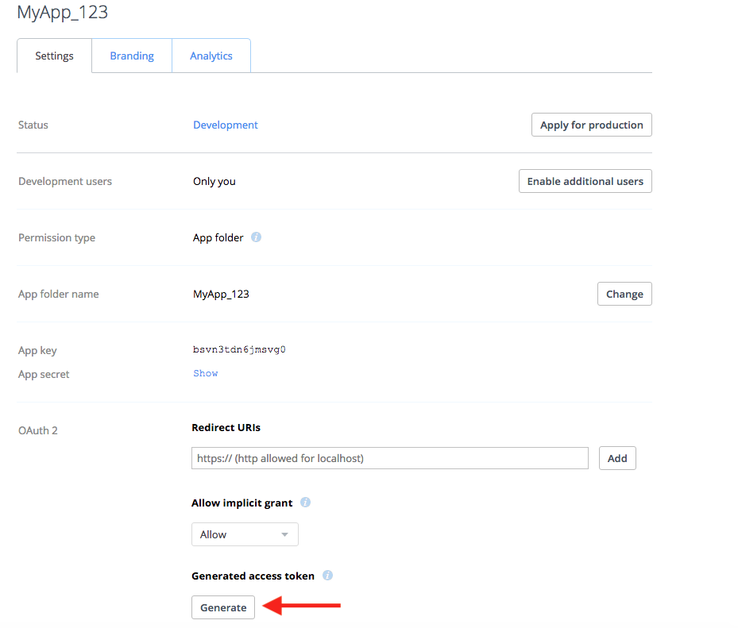
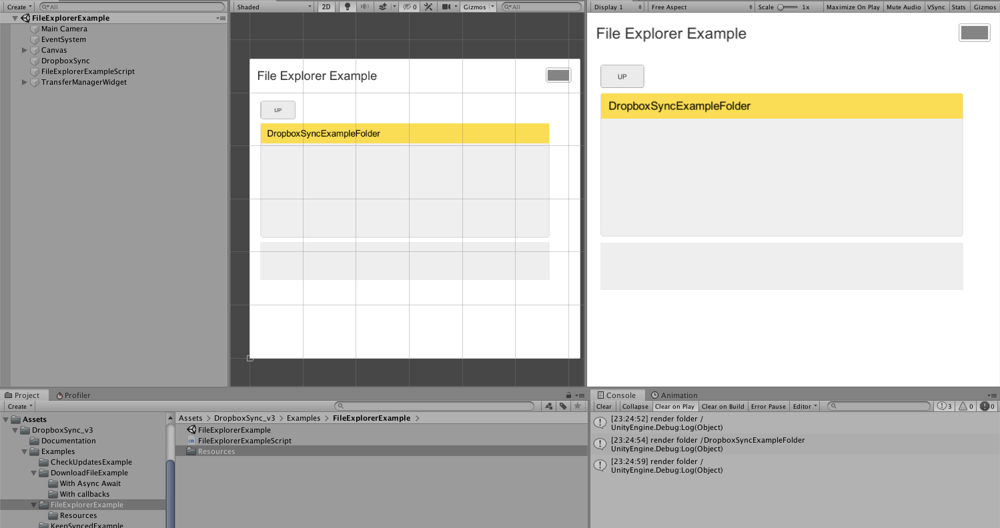

# <a href="http://georgefedoseev.com/" style="text-decoration:none; color: black;">&nbsp;&nbsp;George Fedoseev</a>

[`Go to Documentation`](documentation.html)

# DropboxSync v3.0 Tutorial

### Contents

* [Setting up Dropbox App Folder](#Setting up Dropbox App Folder)
* [Copying Example content for Example scenes](#Copying Example content for Example scenes)
* [Running Example scenes](#Running Example scenes)
  * [DownloadFileExample](#DownloadFileExample)
  * [FileExplorerExample](#FileExplorerExample)
* [Setting up Custom Scene](#Setting up Custom Scene)

## Getting started

### Setting up Dropbox App Folder
#### Step 1
Navigate to <a href="https://www.dropbox.com/developers/apps/" target="_blank">Dropbox App creating page</a> and click **Create app** button.  

#### Step 2
Create new app folder  

#### Step 3
After creation you will be redirected to `https://www.dropbox.com/developers/apps/info/<your-app-key>`. Here you need to generate **accessToken** for your app that will be used by DropboxSync.  

#### Step 4
Copy generated access token and paste into **DropboxSync Script** inspector field in **DownloadFileExample**  scene in Unity (you will find the scene in /DropboxSync_v4/Examples/).  

Now you have example scene connected to your app folder. To run example scenes you need to copy example content to your created app folder. 

### Copying Example content for Example scenes
Save <a href="https://www.dropbox.com/sh/u9yubr1rcydaf9s/AAD5Sf2MTKVTMjZCX8A2t3oOa" target="_blank">this folder</a> to your Dropbox account **and then move it to created app folder** that you copied accessToken for on previous steps.

### Running Example scenes

**NOTE:** for each scene you'll need to insert accessCode of your Dropbox app.

#### DownloadFileExample
Now when you run **DownloadFileExample** scene you should see something like this:  

*(to open **Transfers pop-up** click on the button on the top right)*

#### FileExplorerExample

To run other example scene (**FileExplorerExample**) copy **accessToken** to DropboxSync inspector field same way and click play. You should see something like this:

### Setting up Custom Scene
To use DropboxSync asset in your own scenes create GameObject and attach DropboxSync script to it. Then use asset from your scripts through `DropboxSync.Main` instance.
